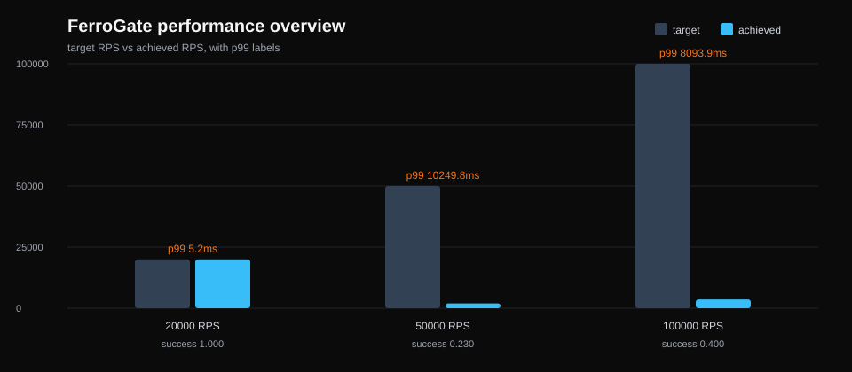
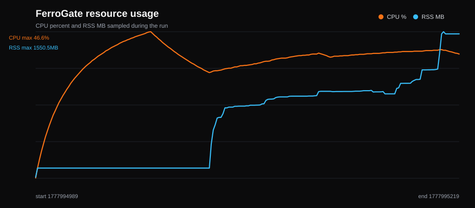
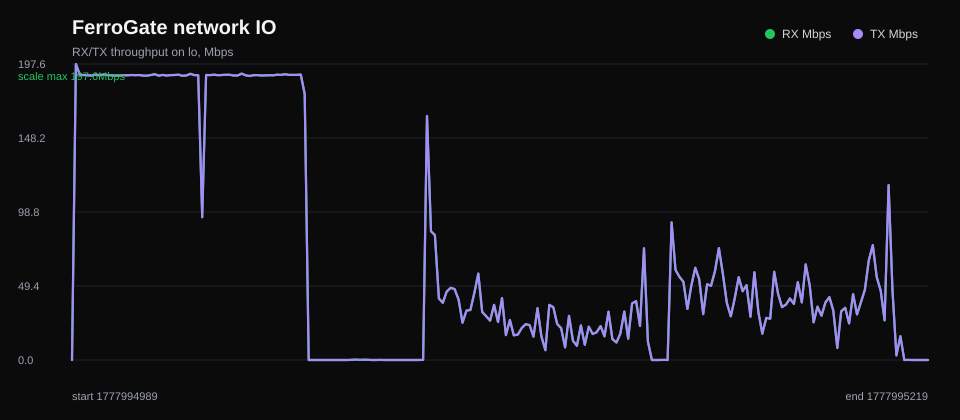
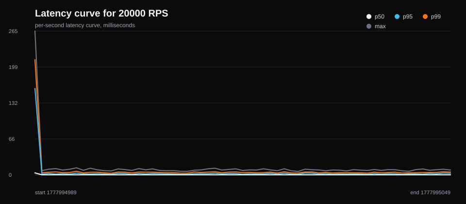
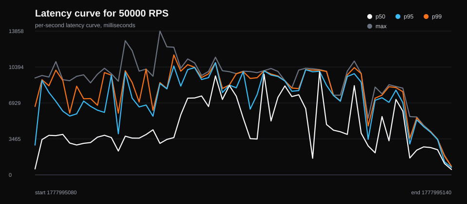
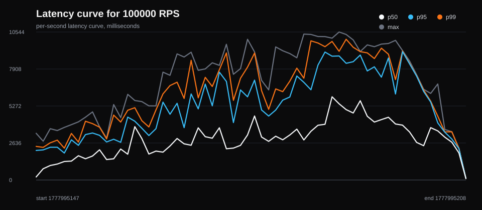

# FerroGate Local 100k Connection Stress Report: v2026.05.05

This report records a sustained local stress run on the maintainer workstation.
The test configured Vegeta with a 100k connection pool and pushed sustained
request stages up to 100k target RPS. It also includes a delayed-response probe
to test whether this single machine can create true 100k in-flight TCP
concurrency against one local gateway address.

This is a workstation limit-finding run, not a cloud capacity claim.

## Environment

- Date: 2026-05-05
- Host kernel: Linux 6.18.9-arch1-2 x86_64
- CPU workers visible: 24
- Memory: 61 GiB total, 55 GiB available before the run
- File descriptor limit: 524288
- Ephemeral port range: `32768 60999` (~28k ports per single destination)
- `tcp_tw_reuse`: 2
- `somaxconn`: 4096
- FerroGate version: 2026.5.5
- Gateway: `127.0.0.1:8088`
- Upstream: local Go `net/http` server on `127.0.0.1:8888`
- Network device sampled: `lo`

## Sustained Request Command

```bash
PATH="$HOME/go/bin:$PATH" scripts/perf-gateway-report.sh \
  --url 'http://127.0.0.1:8088/local/proxy-check?from=100k-sustained' \
  --pid "$(pgrep -n ferrogate)" \
  --net-device lo \
  --connections 100000 \
  --workers 4096 \
  --rates 20000,50000,100000 \
  --duration 60s \
  --timeout 10s \
  --sample-interval 1
```

## Sustained Request Summary

| Target RPS | Requests | Achieved RPS | Success | p50 ms | p95 ms | p99 ms | Max ms | Avg CPU % | Max RSS MB |
| ---: | ---: | ---: | ---: | ---: | ---: | ---: | ---: | ---: | ---: |
| 20000 | 1199999 | 19999.95 | 1.00000 | 0.09 | 2.24 | 5.15 | 264.77 | 33.55 | 107.93 |
| 50000 | 530635 | 1963.80 | 0.22991 | 543.98 | 8941.63 | 10249.82 | 13858.32 | 36.99 | 919.80 |
| 100000 | 574193 | 3601.26 | 0.40017 | 662.69 | 5182.46 | 8093.86 | 10958.50 | 39.85 | 1550.48 |

## Error Distribution

The 50k and 100k target stages were dominated by client-side port exhaustion
from this single local load generator:

### 50k Target RPS

```text
359435 dial tcp 0.0.0.0:0->127.0.0.1:8088: bind: address already in use
 29953 502 Bad Gateway
 19249 context deadline exceeded while awaiting headers
```

### 100k Target RPS

```text
325195 dial tcp 0.0.0.0:0->127.0.0.1:8088: bind: address already in use
 17722 502 Bad Gateway
  1499 context deadline exceeded while awaiting headers
```

## True In-Flight Concurrency Probe

To validate whether this workstation can create true 100k concurrent in-flight
requests to one local gateway address, the upstream held each response for 10
seconds:

```bash
vegeta attack \
  -targets=concurrency-probe/target.txt \
  -rate=3000/1s \
  -duration=30s \
  -connections=100000 \
  -workers=4096 \
  -timeout=15s
```

Result:

```text
Requests      [total, rate, throughput]  89998, 2999.94, 886.65
Duration      [total, attack, wait]      40.000130238s, 29.999915789s, 10.000214449s
Latencies     [mean, 50, 95, 99, max]    3.949076973s, 2.623274ms, 10.001353735s, 10.140028679s, 10.816000334s
Success       [ratio]                    39.41%
Status Codes  [code:count]               0:53702  200:35466  502:830
```

The probe only needs roughly 30k in-flight requests to saturate the single
client/source-port pool. It produced 53,702 `bind: address already in use`
errors, so this host cannot prove 100k true TCP concurrency against one
`127.0.0.1:8088` destination without kernel/source-address/load-generator
tuning.

## Visualizations







### 20k RPS Latency Curve



### 50k RPS Latency Curve



### 100k RPS Latency Curve



## Interpretation

On this workstation, FerroGate sustained the 20k RPS stage with 100% success,
low p99 latency, and about 108 MB max RSS. Above that point, the test no longer
measured gateway capacity cleanly because the local load generator exhausted
the single-destination client port pool and started failing connection binds.

The answer to "can this single local machine prove 100k concurrency?" is no:
the current kernel/client setup cannot create that shape of load. A valid 100k
concurrency test needs one or more of:

- a wider ephemeral port range and related TCP tuning with root access;
- multiple source IP addresses or multiple load-generator hosts;
- multiple gateway destination addresses or ports;
- a load generator profile that explicitly reports active in-flight connections.

## Committed Artifacts

- `stage-summary.csv`: compact sustained stage metrics.
- `process-metrics.csv`: CPU, RSS, RX, and TX samples.
- `rps-50000.aggregate.json` and `rps-100000.aggregate.json`: error details.
- `concurrency-probe/report.txt`: delayed-response concurrency probe summary.
- `concurrency-probe/errors.txt`: delayed-response probe error distribution.
- `overview.svg`, `resource-usage.svg`, `network-io.svg`, `rps-*.latency.svg`.
