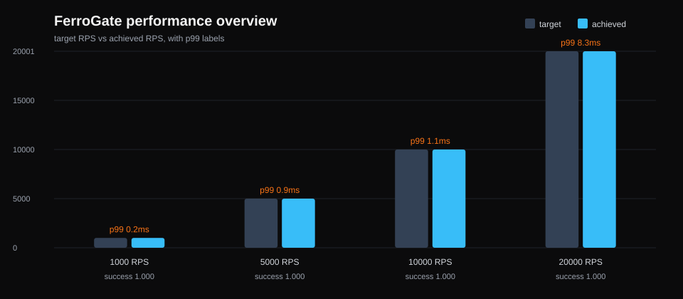
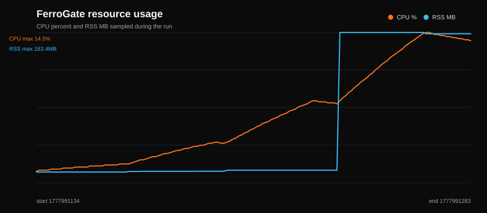
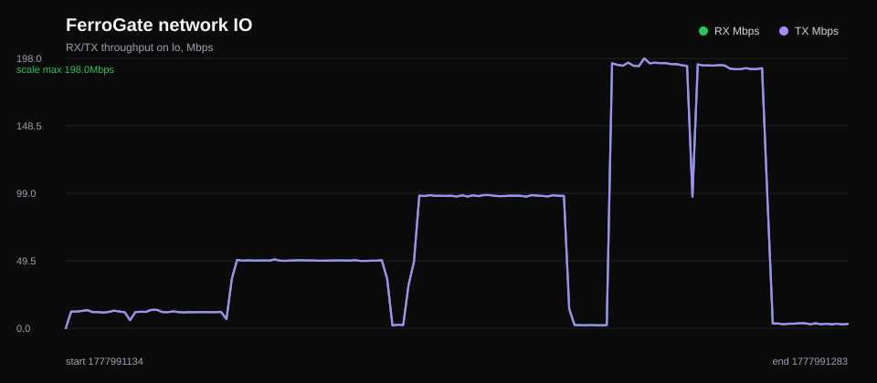
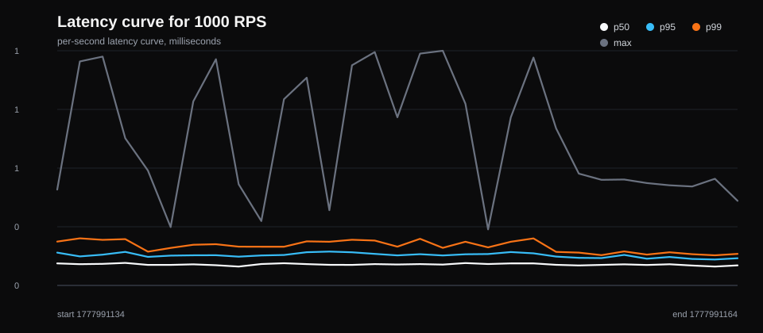
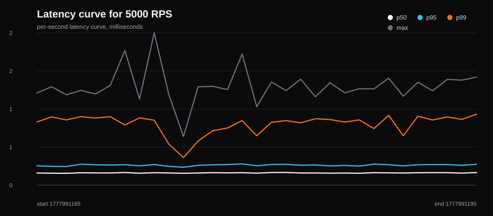
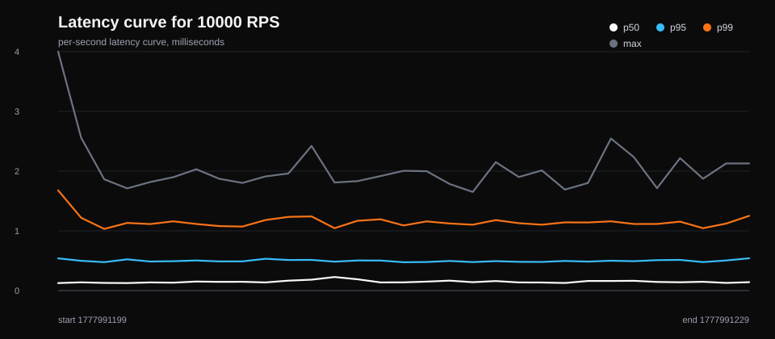
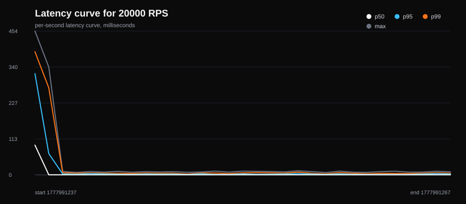

# FerroGate Local Performance Report: v2026.05.05

This report captures a real local baseline run on the maintainer workstation.
It is intended to show local behavior and report formatting, not cloud capacity
limits. The raw Vegeta `*.bin` and HTML plot files remain under the ignored
`perf-reports/` directory and are not committed.

## Environment

- Date: 2026-05-05
- Host kernel: Linux 6.18.9-arch1-2 x86_64
- CPU workers visible: 24
- Memory: 61 GiB total, 54 GiB available before the run
- File descriptor limit: 524288
- FerroGate version: 2026.5.5
- Gateway: `127.0.0.1:8088`
- Upstream: local Go `net/http` server on `127.0.0.1:8888`
- Network device sampled: `lo`

## Command

```bash
PATH="$HOME/go/bin:$PATH" scripts/perf-gateway-report.sh \
  --url 'http://127.0.0.1:8088/local/proxy-check?from=local-baseline' \
  --pid "$(pgrep -n ferrogate)" \
  --net-device lo \
  --connections 10000 \
  --workers 1024 \
  --rates 1000,5000,10000,20000 \
  --duration 30s \
  --timeout 5s \
  --sample-interval 1
```

## Stage Summary

| Target RPS | Requests | Achieved RPS | Success | p50 ms | p95 ms | p99 ms | Max ms | Avg CPU % | Max RSS MB |
| ---: | ---: | ---: | ---: | ---: | ---: | ---: | ---: | ---: | ---: |
| 1000 | 30000 | 1000.01 | 1.00000 | 0.11 | 0.15 | 0.20 | 1.18 | 1.48 | 11.48 |
| 5000 | 150000 | 5000.13 | 1.00000 | 0.17 | 0.28 | 0.86 | 2.10 | 2.88 | 12.29 |
| 10000 | 300000 | 10000.27 | 1.00000 | 0.14 | 0.46 | 1.07 | 3.73 | 5.96 | 13.47 |
| 20000 | 600000 | 20000.60 | 1.00000 | 0.10 | 3.20 | 8.27 | 453.93 | 11.16 | 163.39 |

## Visualizations







### 1000 RPS Latency Curve



### 5000 RPS Latency Curve



### 10000 RPS Latency Curve



### 20000 RPS Latency Curve



## Interpretation

FerroGate sustained the requested 20k RPS local reverse-proxy workload with a
100% success rate across all stages. Latency stayed low through 10k RPS. At 20k
RPS p99 remained below 10 ms, while the max latency showed a single high spike,
so longer duration testing is still needed before treating this as a capacity
claim. RSS grew substantially during the 20k RPS stage under 10k connections;
future full reports should run five-minute stages to confirm whether memory
stabilizes after warmup.

## Committed Artifacts

- `stage-summary.csv`: compact stage metrics.
- `process-metrics.csv`: CPU, RSS, RX, and TX samples.
- `overview.svg`: target vs achieved throughput.
- `resource-usage.svg`: FerroGate CPU and RSS curve.
- `network-io.svg`: loopback RX/TX throughput curve.
- `rps-*.latency.svg`: per-stage latency curves.
