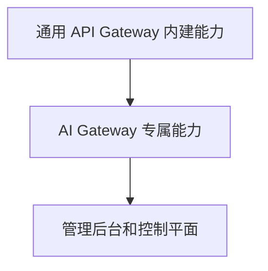
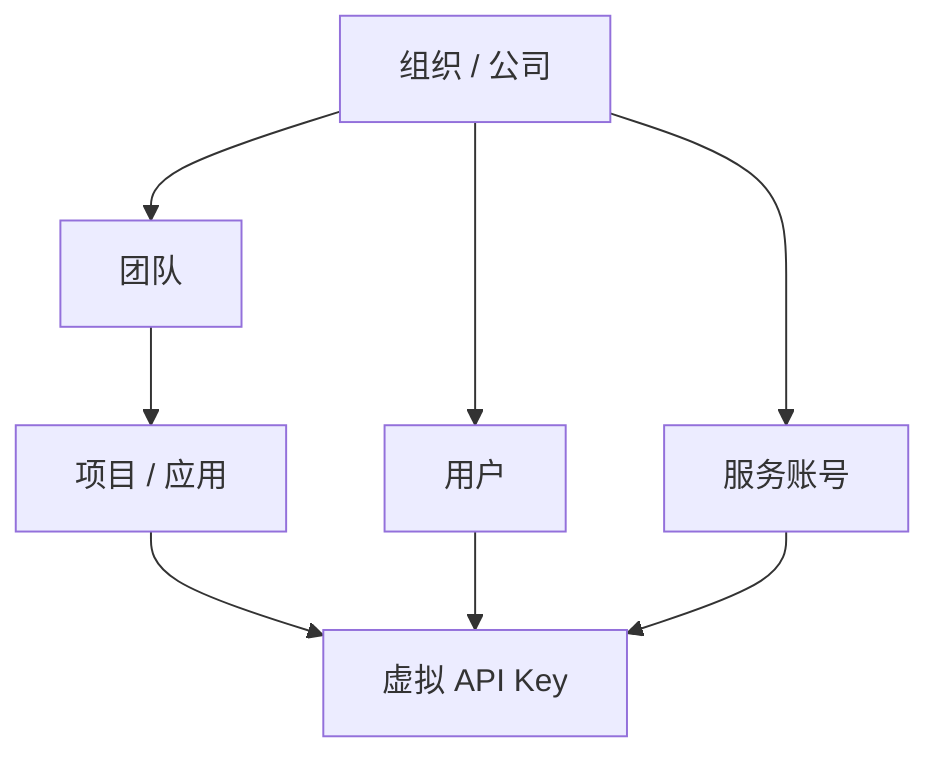

# FerroGate 产品需求文档 PRD

## 1. 产品定位

FerroGate 是一个使用 Rust 实现的开源 API Gateway 和 AI Gateway。

FerroGate 的目标不是只做一个简单的 LLM Proxy，而是要先把 Caddy 这类成熟 API 网关产品中已经被验证过的核心功能完整内建复刻到 FerroGate 中，再在此基础上叠加 AI Gateway 能力。

这里的“复刻”指的是能力复刻和产品体验复刻，不是代码复刻，也不是做一个外部插件生态。FerroGate 应该把通用 API 网关需要的能力作为产品内建模块来实现，包括：

- 反向代理
- 路由匹配
- 上游服务管理
- TLS 和监听器管理
- 配置驱动运行
- 配置校验
- 平滑重载
- 请求/响应中间件流水线
- 认证与授权
- 限流、配额、熔断、重试
- 健康检查
- 结构化访问日志
- 指标、日志、链路追踪
- 管理 API
- 内建后台 Dashboard

在完整 API Gateway 基础之上，FerroGate 需要提供 AI Gateway 的专属能力：

- 虚拟 API Key
- 多模型 Provider 支持
- OpenAI-compatible API 入口
- OpenAI、Anthropic、Gemini、Grok、Azure OpenAI 等官方 API 支持
- Provider 请求/响应格式转换
- Streaming 支持
- 模型别名和模型路由
- Token 统计、成本计算和计费
- 租户隔离
- 企业级组织、团队、用户、项目管理
- 组织内部权限控制
- OpenTelemetry 全链路追踪
- AI 请求日志和审计
- 简易后台 Dashboard，后期可逐步美化和增强

## 2. 产品愿景

FerroGate 要成为面向 AI 流量的 Rust 原生开源网关。

它应该同时满足两类需求：

1. 作为通用 API Gateway，可以承载常规 HTTP/API 网关能力。
2. 作为 AI Gateway，可以统一管理企业或团队内部所有 AI Provider、模型、API Key、Token 用量、日志追踪和计费。

最终用户不应该直接把 OpenAI、Anthropic、Gemini、Grok 等 Provider Key 分散到各个业务系统里，而是统一接入 FerroGate，由 FerroGate 负责：

- 统一入口
- 统一认证
- 统一模型路由
- 统一权限控制
- 统一日志追踪
- 统一 Token 计费
- 统一 Dashboard 管理

## 3. 用户和使用场景

### 3.1 个人开发者

需要一个本地或自托管网关，统一调用不同 AI Provider，避免在代码中硬编码多个 Provider 的 API Key 和差异化调用方式。

### 3.2 创业团队

需要一个低成本、易部署的 AI Gateway，统一管理多个应用、多个 Provider、多个模型的调用和成本。

### 3.3 平台工程团队

需要为企业内部所有 AI 流量提供统一入口、统一治理、统一日志、统一权限和统一计费。

### 3.4 企业组织

需要支持公司、组织、团队、项目、用户、服务账号和 API Key 的多层级隔离与权限管理。

### 3.5 Token4AI Cloud 用户

需要一个开源可控的网关组件，后续可以与 Token4AI Cloud 的用量分析、计费、治理平台对接。

## 4. 核心问题

1. AI Provider API 不统一，鉴权方式、请求格式、响应格式、错误格式、流式协议、用量字段都不同。
2. 业务系统里直接使用官方 Provider Key，安全风险高，难以回收、审计和限权。
3. 企业内部缺少统一的模型访问控制、预算控制和 Token 配额控制。
4. AI 请求日志不完整，很难追踪一次请求从业务系统到网关再到上游 Provider 的完整链路。
5. Token 成本难以按组织、团队、用户、项目、API Key、模型、Provider 维度拆分。
6. 简单 LLM Proxy 通常缺少企业级租户、权限、审计和 Dashboard。
7. 传统 API Gateway 通常不是 AI 原生，缺少模型路由、Token 计费和 Provider 适配能力。
8. 团队需要一个 Rust 实现、可审计、可自托管、可长期演进的网关产品。

## 5. 产品范围

FerroGate 分为三层能力：



### 5.1 通用 API Gateway 内建能力

FerroGate 必须内建完整 API Gateway 能力，不依赖外部插件系统完成核心功能。

需要实现：

- HTTP 反向代理
- 路由匹配
- 上游服务池
- 上游负载均衡
- 上游健康检查
- 故障转移
- 超时控制
- 重试策略
- 熔断策略
- TLS 监听
- 配置文件校验
- 平滑重载
- 请求/响应中间件流水线
- 请求头、响应头改写
- 路径重写
- 访问日志
- 指标采集
- OpenTelemetry 链路追踪
- 管理 API
- 简易 Dashboard

### 5.2 AI Gateway 专属能力

AI Gateway 层负责所有 AI 相关能力：

- 虚拟 API Key
- Provider Registry
- Model Registry
- OpenAI-compatible API 入口
- Provider Adapter
- 模型别名
- 模型路由
- 模型 fallback
- Streaming 响应转发
- Token 统计
- Token 计费
- 成本估算
- 租户级 Policy
- AI 请求审计日志
- Provider 错误归一化
- 请求/响应格式归一化

### 5.3 管理后台和控制平面

前期 Dashboard 可以简单，但必须尽早具备基本管理能力。

MVP Dashboard 应包含：

- 网关概览
- 组织/团队/项目管理
- 用户和权限管理
- 虚拟 API Key 管理
- Provider 配置展示
- Model Registry 展示
- 请求日志查询
- Token 用量汇总
- 成本汇总
- 网关健康状态

后期 Dashboard 需要逐步增强：

- 更美观的 UI
- 实时流量图表
- 成本趋势分析
- Policy 可视化编辑
- 模型路由编辑
- 审计日志查询
- Provider 健康看板
- 权限管理界面
- 企业级报表

### 5.4 Caddy 基础功能复刻和 Caddyfile 兼容范围

FerroGate 需要复刻 Caddy 作为 API 网关/反向代理产品中的核心能力，但不复刻 Caddy 的插件生态模式。FerroGate 的实现方式应该是 Rust 内建模块，不要求用户通过外部插件来获得核心能力。

FerroGate 还必须支持 Caddyfile 风格的启动配置。用户应该可以使用 Caddy 类似的配置体验启动 FerroGate，例如：

```bash
ferrogate run --config Ferrogate/Caddyfile
ferrogate validate --config Ferrogate/Caddyfile
```

其中 `Ferrogate/Caddyfile` 是 FerroGate 需要支持的标准 Caddyfile 风格启动配置路径。后续也可以支持 `./Caddyfile`、`./ferrogate.toml` 等路径，但不能影响 `Ferrogate/Caddyfile` 的一等支持。

FerroGate 实现 Caddy 基础能力时，必须下载并对照 Caddy 官方源码进行设计审查，当前参考源码建议放在仓库本地忽略目录 `.references/caddy`。对照目标是理解 Caddy 的配置解析、Caddyfile adapter、HTTP directive、route/handle/reverse_proxy/log/tls 等成熟产品语义，并将这些语义用 Rust、Pingora 和 FerroGate 自身模块重新实现。严禁复制 Caddy 的 Go 源码、内部架构或许可证不兼容实现。

#### 5.4.1 必须内建复刻的 Caddy 基础能力

- 多监听地址和端口配置，包括 `:8080`、`localhost:8080`、域名站点块。
- HTTP/HTTPS 入口管理。
- TLS 配置和证书加载，后续支持自动证书管理。
- HTTP 反向代理，对应 Caddy `reverse_proxy` 的基础能力。
- Path、Host、Method、Header、Query 匹配。
- `route`、`handle`、`handle_path` 风格的路由分组和处理链语义。
- Header 匹配、请求 Header 改写、响应 Header 改写。
- Path rewrite 和 URI rewrite。
- Query 参数处理。
- 上游 upstream pool。
- 负载均衡。
- 主动/被动健康检查。
- 超时、重试、故障转移。
- 静态响应和健康检查响应，对应 `respond` 基础能力。
- 重定向，对应 `redir` 基础能力。
- 请求/响应压缩，对应 `encode` 基础能力，后续逐步支持 gzip、zstd。
- 访问日志和错误日志，对应 `log` 基础能力。
- 管理 API。
- 配置文件校验。
- 配置热加载/平滑重载。
- 中间件处理链。
- 基础安全能力，例如请求体大小限制、Header 限制、速率限制。
- 运行时状态查看。

#### 5.4.2 Caddyfile 兼容目标

FerroGate 的 Caddyfile 兼容是“核心反向代理和网关语义兼容”，不是 Caddy 全插件生态兼容。

MVP 必须支持以下 Caddyfile 子集或给出明确可读的校验错误：

- 全局选项块，例如日志、admin endpoint、debug、默认配置。
- Site block，例如 `:8080 { ... }`、`example.com { ... }`。
- Matcher，包括 path、host、method、header、query 的基础匹配。
- `reverse_proxy`，包括单上游、多上游、基础负载均衡、超时配置。
- `route` / `handle` / `handle_path` 的基础路由组织。
- `header`，包括请求/响应 Header 设置、删除和追加。
- `rewrite` / `uri` 的基础路径和 URI 改写。
- `respond` 静态响应。
- `redir` 重定向。
- `encode` 压缩声明。
- `tls` 手动证书配置，自动证书能力后续增强。
- `log` 访问日志配置。

FerroGate 可以扩展 Caddyfile 语法，增加 AI Gateway 专属 directive，例如 `ai_gateway`、`provider`、`model`、`virtual_key`、`policy`、`billing` 等，但扩展语法必须保持和 Caddyfile 的块结构、缩进风格、可读性一致。

#### 5.4.3 不需要复刻的部分

- 不做 Caddy 外部插件生态。
- 不要求用户通过插件安装核心网关能力。
- 不复制 Caddy 的 Go 语言实现和内部架构。
- 不要求兼容 Caddy 所有第三方插件 directive。
- 不要求第一阶段实现 Caddy 自动 HTTPS 的完整体验，但配置模型和 TLS 边界必须为后续自动证书管理预留空间。

产品判断标准：如果一个团队原本想用成熟 API 网关做 HTTP 反向代理、路由、TLS、重载、日志和上游治理，那么 FerroGate 应该能覆盖这些基础网关场景；如果这个团队已有基础 Caddyfile 反向代理配置，FerroGate 应该能读取兼容的 `Ferrogate/Caddyfile` 启动配置或给出明确迁移诊断；如果这个团队还需要 AI Provider 管理、Token 计费、虚拟 API Key、租户权限和 AI 请求追踪，那么 FerroGate 应该比传统网关更适合。

## 6. 功能需求

## 6.1 虚拟 API Key 系统

### 目标

业务系统只使用 FerroGate 发放的虚拟 API Key，不直接接触 OpenAI、Anthropic、Gemini、Grok 等上游 Provider Key。

### 功能要求

- 创建虚拟 API Key
- 禁用虚拟 API Key
- 删除虚拟 API Key
- 轮换虚拟 API Key
- 设置过期时间
- Key 只存储 Hash，不存储明文
- Key 绑定组织、团队、项目、用户或服务账号
- Key 支持作用域 Scope
- Key 支持模型 allowlist/denylist
- Key 支持 Provider allowlist/denylist
- Key 支持请求限流
- Key 支持 Token 配额
- Key 支持成本预算
- Key 支持审计记录

### 示例配置

```toml
[[api_keys]]
name = "prod-web-app"
owner = "team-platform"
scopes = ["chat.completions", "models.read"]
allowed_models = ["gpt-4o", "claude-3-5-sonnet", "gemini-1.5-pro"]
monthly_token_budget = 100000000
rate_limit = "600r/m"
```

### 验收标准

- 客户端可以用一个虚拟 API Key 调用 FerroGate。
- FerroGate 可以根据 Key 解析出组织、团队、项目、用户上下文。
- 上游 Provider Key 不暴露给业务系统。
- 被禁用、过期、超限的 Key 会被拒绝并返回统一错误。

## 6.2 Provider 支持

### 目标

FerroGate 需要支持主流官方 AI Provider，并通过统一接口隐藏 Provider 差异。

### 首批 Provider

- OpenAI
- Anthropic
- Google Gemini
- xAI Grok
- Azure OpenAI

### 后续 Provider

- Mistral
- Cohere
- Together AI
- DeepSeek
- Perplexity
- Groq
- AWS Bedrock
- Google Vertex AI
- OpenRouter
- 自托管 OpenAI-compatible 服务

### Provider Adapter 职责

每个 Provider Adapter 需要负责：

- 鉴权 Header 注入
- Endpoint 映射
- 请求体转换
- 响应体转换
- Streaming 协议转换
- 错误码归一化
- 模型名映射
- Usage 字段提取
- 是否可重试判断
- Provider 健康状态检查

## 6.3 Model Registry 和模型路由

### 目标

用户应该使用逻辑模型名调用 FerroGate，由 FerroGate 决定具体路由到哪个 Provider 和模型。

### 功能要求

- 注册逻辑模型名，例如 `fast-chat`、`best-reasoning`、`cheap-summary`
- 逻辑模型映射到一个或多个 Provider 模型
- 支持模型别名
- 支持优先级 fallback
- 支持权重路由
- 支持租户级模型可见性
- 支持模型能力描述，例如 chat、embedding、vision、tools、streaming
- 支持模型价格信息
- 支持上下文长度配置

### 示例配置

```toml
[[models]]
name = "fast-chat"
primary = "openai:gpt-4o-mini"
fallbacks = ["gemini:gemini-1.5-flash", "grok:grok-2-mini"]
capabilities = ["chat", "streaming", "tools"]
```

## 6.4 OpenAI-compatible API 入口

### 目标

尽量让现有 OpenAI SDK 可以直接接入 FerroGate。

### MVP Endpoint

- `GET /healthz`
- `GET /v1/models`
- `POST /v1/chat/completions`

### 后续 Endpoint

- `POST /v1/completions`
- `POST /v1/embeddings`
- `POST /v1/responses`
- `POST /v1/images/generations`
- `POST /v1/audio/transcriptions`
- Provider-specific passthrough path

### 要求

- 统一错误格式
- 支持 Streaming
- 每个响应带 Request ID
- 日志中记录逻辑模型、实际 Provider 和实际模型
- 兼容模式不能阻碍 Provider 特有能力扩展

## 6.5 OpenTelemetry 全链路日志追踪

### 目标

每一次 AI 请求都必须能被追踪，从客户端进入 FerroGate，到鉴权、租户解析、策略判断、模型路由、Provider 调用、响应转换、Token 计费，全链路可观测。

### 功能要求

- 集成 OpenTelemetry traces、metrics、logs
- 支持 trace ID 透传和生成
- 支持 request ID 生成
- 支持 JSON 结构化日志
- 支持对接 OTel Collector
- 支持日志脱敏
- 支持按租户/项目/API Key 配置是否记录 prompt 和 response body

### Span 设计

需要至少包含以下 Span：

- inbound request
- virtual api key authentication
- tenant context resolution
- policy evaluation
- model routing
- provider adapter transform
- upstream provider call
- retry attempt
- fallback attempt
- streaming lifecycle
- token usage extraction
- billing event creation

### 日志字段

每条请求日志至少包含：

- request_id
- trace_id
- organization_id
- team_id
- project_id
- user_id
- api_key_id，不能记录原始 Key
- route
- logical_model
- provider
- provider_model
- upstream_host
- status_code
- latency_ms
- retry_count
- fallback_count
- prompt_tokens
- completion_tokens
- total_tokens
- estimated_cost
- error_code
- policy_decision

## 6.6 租户隔离和企业级权限

### 目标

FerroGate 必须支持企业级多租户管理，包括组织/公司、团队、项目、用户、服务账号和 API Key。

### 租户层级



### 核心实体

- Organization / Company
- Team
- Project / App
- User
- Service Account
- Virtual API Key
- Role
- Permission
- Policy
- Billing Account

### 初始角色

- Owner
- Admin
- Billing Admin
- Developer
- Viewer
- Service Account

### 权限示例

- 管理组织设置
- 管理团队
- 管理用户
- 管理项目
- 管理虚拟 API Key
- 查看请求日志
- 查看 Token 用量
- 查看成本
- 编辑 Provider 配置
- 编辑模型路由
- 编辑 Policy
- 查看审计日志

### 隔离要求

- 所有租户数据必须带 organization_id。
- 虚拟 API Key 必须解析到唯一租户上下文。
- 用户只能查看自己有权限的日志、用量和成本。
- Provider 凭据可以是全局级、组织级或项目级。
- Policy 支持从组织到团队到项目到 Key 的继承和覆盖。

## 6.7 Token 计费系统

### 目标

FerroGate 必须记录 AI 用量，并支持基于 Token 的成本统计、预算控制和计费事件输出。

### 功能要求

- 记录 prompt tokens
- 记录 completion tokens
- 记录 total tokens
- 记录 cached tokens，如果 Provider 支持
- Provider 不返回 usage 时支持估算
- 维护模型价格表
- 计算单次请求成本
- 按组织、团队、项目、用户、API Key、Provider、模型、时间维度聚合
- 支持月度预算
- 支持预付费额度
- 支持软限制和硬限制
- 生成 billing events
- 支持企业内部成本分摊

### Billing Event 字段

- event_id
- request_id
- timestamp
- organization_id
- team_id
- project_id
- user_id
- api_key_id
- provider
- provider_model
- logical_model
- prompt_tokens
- completion_tokens
- total_tokens
- unit_price_input
- unit_price_output
- calculated_cost
- currency
- billing_status

## 6.8 Policy Engine

### 目标

FerroGate 需要在请求到达上游 Provider 前执行统一治理策略。

### 必须支持的 Policy

- 模型 allowlist/denylist
- Provider allowlist/denylist
- 请求频率限制
- Token 频率限制
- 日/月 Token 预算
- 最大 prompt 长度
- 最大 output tokens
- 最大请求体大小
- 允许的 API 能力
- dev/staging/prod 环境隔离
- prompt/body 日志策略
- 组织、团队、项目、Key 多级策略继承

### 后续 Policy

- 内容安全检测
- PII 检测
- 数据驻留规则
- 按地域、成本、延迟做 Provider 选择
- 高成本模型审批流程

## 6.9 路由、负载均衡和故障转移

### 目标

FerroGate 需要可靠地将请求路由到合适的 Provider 和模型。

### 功能要求

- 静态路由规则
- 模型别名
- 权重路由
- 优先级 fallback
- Provider 健康检查
- 超时策略
- 重试策略
- 熔断器
- 租户级路由规则
- 成本优先路由，后续阶段
- 延迟优先路由，后续阶段

## 6.10 管理 API

### 目标

Dashboard 和自动化工具都应该通过稳定的 Admin API 操作 FerroGate。

### API 范围

- organizations
- teams
- users
- projects
- service accounts
- virtual api keys
- providers
- models
- policies
- usage summaries
- billing events
- request logs
- gateway status

### 要求

- RBAC 保护
- 所有写操作进入审计日志
- API 版本化
- Dashboard 不直接访问内部状态，只通过 Admin API

## 6.11 Dashboard

### 目标

前期提供简单但可用的后台 Dashboard，后期逐步美化。

### MVP 页面

- 登录页或本地管理员入口
- Overview 概览
- 组织管理
- 团队管理
- 项目管理
- 用户和角色管理
- 虚拟 API Key 管理
- Provider 配置
- Model Registry
- 请求日志
- Token 用量
- 成本汇总
- 网关健康状态

### 后续页面

- Policy 编辑器
- 模型路由编辑器
- 实时 Trace Viewer
- 成本报表
- 审计日志
- Provider 健康看板
- UI 主题和视觉美化

## 6.12 配置系统

### 目标

FerroGate 前期采用文件配置优先，后期支持动态控制平面。

FerroGate 的一等启动配置格式必须兼容 Caddyfile 风格，标准路径为 `Ferrogate/Caddyfile`。

FerroGate 可以保留 TOML 作为内部结构化配置、测试配置或过渡配置，但不能以 TOML 替代 Caddyfile 兼容目标。

### 功能要求

- MVP 支持读取和校验 `Ferrogate/Caddyfile`
- MVP 支持 Caddyfile 风格 Site block、matcher、`reverse_proxy`、`route`、`handle`、`handle_path`、`header`、`rewrite`、`respond`、`redir`、`encode`、`tls`、`log` 的基础子集
- 支持将 Caddyfile 风格配置解析为 FerroGate 内部 typed config model
- 可选支持 TOML 配置作为内部调试和测试入口
- 启动前配置校验
- 支持环境变量引用 Secret
- 支持配置平滑重载
- 区分启动配置和动态业务配置
- 配置错误必须包含文件名、行列号、directive 名称和可读迁移建议

## 7. 非功能需求

### 7.0 技术底座硬性约束

- FerroGate 必须按照标准化 Rust 大型工程代码库来设计和实现，而不是以单文件 Demo、脚本式原型或短期验证项目的方式推进。
- 工程结构必须采用清晰的 workspace/crate/module 分层，区分网关运行时、领域模型、配置系统、Provider Adapter、Policy Engine、计费、存储、Admin API、Dashboard 适配和可观测性等边界。
- 所有核心模块必须通过显式接口、错误类型、配置模型和测试边界进行解耦，避免跨层直接依赖和隐式全局状态。
- 代码必须遵循 Rust 大型工程实践，包括 `cargo fmt`、`cargo clippy`、单元测试、集成测试、文档注释、错误上下文、feature gate、CI 校验和可维护的 crate 依赖管理。
- 新功能实现必须优先补充或更新对应文档、设计说明、测试用例和执行计划进度，保证 PRD、架构文档、开发计划与代码实现保持同步。
- FerroGate 的 API Gateway 与 AI Gateway 网络代理运行时必须基于 Cloudflare Pingora 开发。
- 监听、反向代理、上游连接、请求/响应过滤、平滑关闭、后续热重载和负载均衡都应优先使用 Pingora 能力承载。
- 不允许将 `axum`、`reqwest`、`hyper` 等通用 Web/HTTP 客户端框架作为核心网关运行时替代 Pingora。
- 其他 Rust 库只能作为管理 API、辅助工具或非代理关键路径组件使用，不能绕过 Pingora 的代理生命周期。
- FerroGate 的产品代码重点放在路由策略、AI Provider 适配、虚拟 API Key、租户权限、计费、审计、可观测性和 Dashboard，而不是重写 Pingora 已经提供的底层网络能力。

### 7.1 性能

- 代理路径开销要低。
- Streaming 响应不能完整缓冲。
- Key 查询、路由匹配、Policy 判断必须高效。
- Token 计费不能明显阻塞响应路径。

### 7.2 可靠性

- 支持平滑关闭。
- 支持平滑重载。
- 支持上游超时控制。
- 支持重试和 fallback。
- Provider 错误要归一化。

### 7.3 安全

- 虚拟 API Key 只存 Hash。
- 不记录原始 API Key。
- 不记录上游 Provider Secret。
- 默认脱敏敏感字段。
- Admin API 必须 RBAC。
- 控制平面写操作必须审计。

### 7.4 可观测性

- OpenTelemetry 优先。
- 所有请求有 request_id 和 trace_id。
- 支持结构化日志。
- 支持流量、错误率、延迟、Token、成本指标。

### 7.5 可维护性

- 不做外部插件体系作为早期目标。
- 使用内建模块化设计，将 Provider、Policy、计费、日志、Dashboard 等能力分层实现。
- 内部模块接口要清晰，便于后续维护和重构。
- Dashboard 必须通过 Admin API，而不是直接依赖内部实现。

## 8. 里程碑

本节是产品级里程碑，必须与 [[03-development/prd-implementation-plan|PRD 执行计划任务]] 的 P0-P8 阶段保持一致。执行计划负责维护 checklist、进度、验收命令和阶段产出；本节只描述每个阶段的产品交付边界。

### P0: 工程基线、crate 边界与 Caddyfile 配置契约

- Rust workspace 和核心 crate/module 边界
- `ferrogate run` / `ferrogate validate` 命令契约
- `Ferrogate/Caddyfile` 一等启动配置路径
- Caddyfile 风格配置 parser/adapter 边界
- 内部 typed config model
- Caddy 官方源码语义对照清单
- 基础质量门禁和文档骨架

### P1: Pingora 通用 API Gateway Runtime 垂直切片

- 基于 Pingora 的监听器和代理服务
- 配置驱动的普通 HTTP 反向代理
- Host/Path/Header 路由匹配
- upstream pool 和基础负载均衡
- 请求/响应 Header 改写和 path rewrite
- `/healthz` 健康检查响应
- request_id 和结构化访问日志

### P2: 配置校验、生命周期和平滑重载

- Caddyfile 风格监听器、路由、upstream、TLS、日志、Provider、模型、API Key 配置模型
- 启动前配置校验和字段级错误诊断
- Secret 环境变量引用和脱敏错误输出
- Pingora-backed 平滑重载接口
- 配置快照、版本号和失败回滚语义
- Caddy 风格 `run`、`validate`、未来 `reload` 子命令约定，保留 `check` 作为 `validate` 兼容别名

### P3: OpenAI-compatible AI Proxy MVP

- Provider Adapter trait MVP
- OpenAI-compatible Adapter 最小实现
- `GET /v1/models`
- `POST /v1/chat/completions` 非流式路径
- `stream=true` SSE 转发
- 统一错误响应格式
- logical_model、provider、provider_model 记录

### P4: 虚拟 API Key、租户上下文与 Policy MVP

- 虚拟 API Key 生成、Hash 存储和校验
- Organization、Team、Project、User、Service Account、Role、Permission、Policy 核心模型
- API Key 到唯一租户上下文的解析
- Key、Tenant、Policy repository 边界
- 模型和 Provider allowlist/denylist
- 基础请求频率限制和 Token 预算接口
- Auth 与 Policy 接入 AI Proxy 请求路径

### P5: 多 Provider Adapter 与 Model Registry

- OpenAI、Anthropic、Gemini、Grok、Azure OpenAI Adapter
- Provider 请求/响应转换、Streaming、错误归一化、usage 提取
- Model Registry、模型别名、模型能力、价格和上下文长度
- 优先级 fallback 和权重路由
- 租户级模型可见性

### P6: 可观测性、请求日志、Storage 与计费事件

- OpenTelemetry traces、metrics、logs
- PRD 要求的 AI 请求 span 层级
- 结构化请求日志模型和 repository
- Token usage 提取和估算接口
- 模型价格表和成本计算
- Billing Event 模型和异步写入接口
- in-memory/file storage 以及 SQLite/Postgres 扩展边界

### P7: Admin API 与 Dashboard MVP

- 版本化 Admin API
- RBAC 保护和写操作审计
- 组织、团队、项目、用户、API Key、Provider、Model、Policy、Usage、Request Log 查询接口
- Dashboard 通过 Admin API 访问数据
- Overview、API Key、Provider、Model、请求日志、Token 用量、网关健康页面

### P8: 生产级可靠性、安全和部署增强

- 熔断器
- 请求限流和 Token 限流
- 超时、重试、fallback 策略
- Provider 健康检查和健康看板
- TLS 配置和证书加载增强
- 供应链与安全检查
- 性能基准和 streaming 压测
- 部署文档、运维手册和容量评估指南

## 9. 开放问题

1. Dashboard 前期是否内嵌到 Rust Binary，还是单独作为前端包发布？
2. 租户、Key、Usage 数据必须先有 storage/repository 抽象；首个持久化 backend 应选择 SQLite 还是 Postgres？
3. Token 计费事件应该同步写入、异步写入，还是事件队列化？
4. Prompt/Response Body 日志默认应该关闭还是按租户策略控制？
5. Admin API 是否默认开启，还是必须显式配置？
6. Provider Secret 应该支持配置文件、数据库、外部 Secret Manager 中的哪些方式？
7. 是否需要在开源版和商业托管版之间区分高级企业功能？

## 10. 成功指标

- 10 分钟内完成第一个可用 AI Gateway 配置。
- 一个虚拟 API Key 可以按模型别名路由到多个 Provider。
- 每次请求都有 request_id、trace_id、租户上下文、Provider、模型、延迟、Token 用量和成本。
- 企业用户可以管理组织、团队、项目、用户、服务账号和 API Key。
- Dashboard 可以回答：谁用了哪个模型、用了多少 Token、花了多少钱、请求为什么失败。
- FerroGate 可以作为完整 API Gateway 运行，而不仅仅是 AI Proxy。
