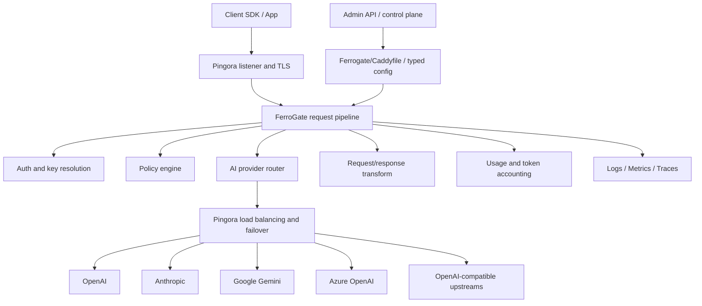

# FerroGate architecture and functional modules

FerroGate is an AI gateway implemented in Rust. The long-term product direction is to provide a mature API gateway experience for AI traffic while using Cloudflare's [Pingora](https://github.com/cloudflare/pingora) as the high-performance proxy foundation.

## Product positioning

FerroGate should feel like **a complete API gateway for AI APIs**:

- simple configuration first
- safe defaults
- automatic operational ergonomics where possible
- extensible modules
- production-grade proxying
- clear observability
- a developer experience that is easy to reason about

FerroGate should reproduce the important capabilities expected from production API gateways, then specialize them for LLM providers, OpenAI-compatible APIs, tokens, usage accounting, and AI governance.

## Why Pingora

Pingora is a Rust framework for building fast, reliable, and programmable networked systems. It provides a strong foundation for FerroGate because it already supports:

- async Rust proxy infrastructure
- HTTP/1 and HTTP/2 end-to-end proxying
- TLS support through multiple backends
- graceful reload
- customizable load balancing and failover
- gRPC and WebSocket proxying
- integration points for observability

FerroGate should use Pingora for the lower-level proxy runtime and focus FerroGate-specific code on AI routing, provider normalization, policy, observability, and configuration experience.

## High-level architecture



## Runtime layers

### 1. Network and proxy runtime

Responsible for accepting traffic, TLS, connection handling, upstream proxying, retries, timeouts, load balancing, and graceful reload.

Initial implementation direction:

- use `pingora-core` for service lifecycle
- use `pingora-proxy` for HTTP proxy behavior
- use `pingora-load-balancing` for upstream pools and failover
- use Pingora's graceful reload model for config reloads

### 2. FerroGate request pipeline

This is the AI-specific gateway pipeline that runs around the proxy path.

Typical stages:

1. receive inbound request
2. identify tenant, project, and API key
3. parse OpenAI-compatible route
4. apply policy and quota checks
5. select provider/model/upstream
6. normalize request for the selected provider
7. proxy through Pingora
8. normalize response back to the client contract
9. record usage, latency, tokens, and errors

### 3. Configuration and control plane

FerroGate should support a simple file-first workflow while leaving room for a future dynamic control plane.

Near-term config:

- `Ferrogate/Caddyfile` as the default startup path
- explicit TOML config for internal tests and transitional workflows
- provider definitions
- routes and model aliases
- upstream pools
- timeout/retry/load balancing options
- auth keys and env var references

Reload lifecycle contract:

1. `ferrogate reload --config <path>` first loads and validates the candidate config.
2. Validation produces a deterministic snapshot id from the normalized typed config.
3. Until Pingora-backed hot reload is implemented, reload runs in `mode=validate-only` and reports `swap=false`.
4. Invalid candidates fail before any runtime swap path and must not emit a success report.
5. The future Pingora-backed implementation must only replace the active snapshot after candidate validation succeeds; failed candidates keep the current snapshot active.
6. The runtime reload state machine uses prepare/commit/reject semantics: prepare creates a candidate snapshot without publishing it, commit replaces the active snapshot, and reject returns the unchanged active snapshot with the failure reason.
7. The CLI lifecycle report must call the runtime reload state machine even before Pingora hot reload is wired, so external command semantics and runtime semantics cannot drift.
8. `/admin/status` exposes the active snapshot id. Failed reload tests must compare this value before and after an invalid candidate to prove the active config was not changed.

Future config direction:

- gateway-style readable config syntax
- hot reload
- admin API
- optional Token4AI Cloud managed config sync

### 4. Provider abstraction

Provider implementations isolate vendor-specific behavior.

Each provider adapter should own:

- endpoint mapping
- auth header injection
- model name translation
- request body transformation
- response body transformation
- streaming behavior
- error mapping
- usage extraction

P3 当前的 OpenAI-compatible adapter MVP 已经把 endpoint mapping、auth header planning、model name translation、stream flag preservation 和 chat completion request body transformation 固化在 `ferrogate-providers` crate 中。Gateway 只调用 adapter 生成 provider request plan，再通过 gateway dispatch 边界执行 HTTP upstream 调用，并已支持透传 provider 的 `text/event-stream` SSE response body。HTTPS dispatch、response transformation、真正增量式 streaming、error mapping 和 usage extraction 继续作为后续 P3 切片推进。

### 5. Policy and governance

Policy is applied before and after provider routing.

Policy examples:

- API key authentication
- tenant/project isolation
- model allow/deny lists
- rate limits
- token budgets
- request size limits
- prompt/content guard hooks
- audit logging hooks

### 6. Observability and usage accounting

FerroGate must make AI traffic observable by default.

Core telemetry:

- request ID
- tenant/project/key identity
- selected provider/model/upstream
- request latency
- upstream latency
- status code and provider error code
- prompt/completion/total tokens when available
- retry/failover events
- policy decision events

## Functional module map

| Module | Responsibility | Initial priority |
| --- | --- | --- |
| CLI | `run`, `validate`, `reload`, and `check` compatibility alias | P0 |
| Config loader | Parse and validate gateway configuration | P0 |
| Pingora runtime | Listener, proxy lifecycle, graceful reload | P0 |
| Route matcher | Match OpenAI-compatible paths and future route rules | P0 |
| Provider router | Select provider/model/upstream | P0 |
| Provider adapters | OpenAI-compatible first, then OpenAI/Anthropic/Gemini/Azure | P1 |
| Auth module | Gateway API key validation and upstream secret resolution | P1 |
| Policy engine | Quotas, limits, allow/deny rules, hooks | P1 |
| Usage accounting | Token and request metrics | P1 |
| Observability | tracing, metrics, structured logs | P1 |
| Admin API | config reload, status, provider health | P2 |
| Built-in module system | 内建 Provider、Policy、Observability、Dashboard 模块边界 | P2 |
| Static docs/wiki | Product and architecture documentation | P0 |

## General API gateway capabilities translated to FerroGate

| General gateway concept | FerroGate equivalent |
| --- | --- |
| Reverse proxy | AI provider proxy and model router |
| Readable config syntax | `Ferrogate/Caddyfile` plus typed internal config |
| Automatic HTTPS | TLS defaults and certificate automation as a later module |
| Built-in modules | Provider adapters, policy modules, observability sinks |
| Admin API | Gateway runtime control plane |
| Hot reload | Pingora-backed graceful config reload |
| Site blocks/routes | Tenant/project/model route blocks |

## Suggested crate/module structure

```text
src/
  main.rs
  cli.rs
  config/
    mod.rs
    schema.rs
    validate.rs
  runtime/
    mod.rs
    pingora_service.rs
    reload.rs
  proxy/
    mod.rs
    pipeline.rs
    request_context.rs
  routing/
    mod.rs
    matcher.rs
    provider_router.rs
    upstream_pool.rs
  providers/
    mod.rs
    openai_compatible.rs
    openai.rs
    anthropic.rs
    gemini.rs
    azure_openai.rs
  policy/
    mod.rs
    auth.rs
    limits.rs
    decisions.rs
  usage/
    mod.rs
    tokens.rs
    accounting.rs
  observability/
    mod.rs
    tracing.rs
    metrics.rs
  admin/
    mod.rs
    api.rs
```

## MVP implementation sequence

1. Keep existing Axum health/config prototype as a temporary bootstrap.
2. Add Pingora dependencies and introduce a minimal Pingora HTTP proxy service.
3. Implement `GET /healthz` outside or beside the proxy path.
4. Implement OpenAI-compatible `/v1/models` from config.
5. Implement OpenAI-compatible chat completions proxy to one upstream.
6. Add provider router and upstream pool.
7. Add structured tracing and request IDs.
8. Add auth and basic policy checks.
9. Add streaming support and provider error normalization.
10. Add graceful reload from config.

## Key design principles

- Use Pingora for networking and proxy mechanics.
- Keep FerroGate's AI semantics independent from Pingora internals.
- Prefer explicit typed interfaces for providers and policies.
- Keep the first config format simple and stable.
- Design for hot reload and operational introspection from the beginning.
- Do not build an external plugin system as an early goal. Keep core gateway capabilities built in and maintain clear internal module boundaries.
