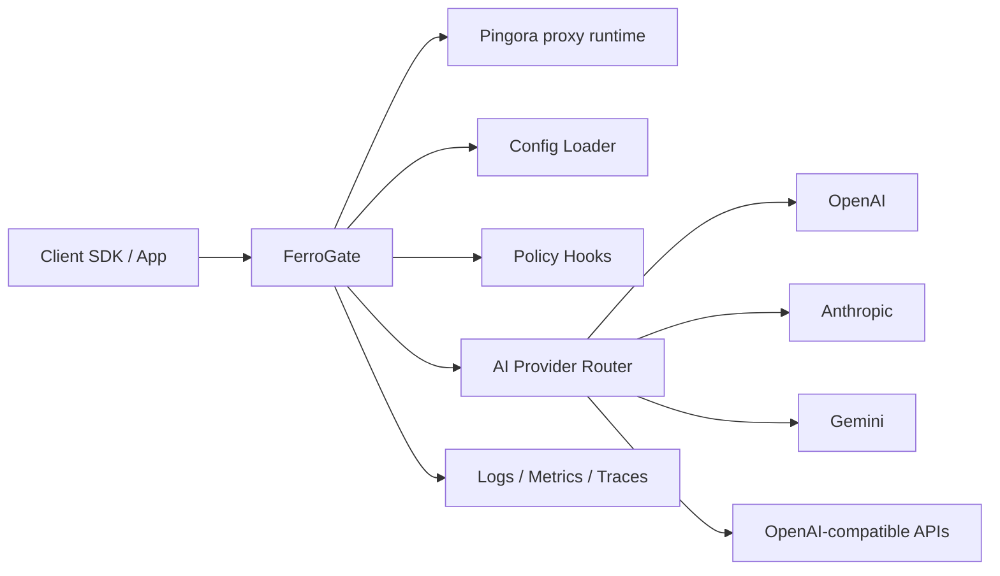

# System architecture

FerroGate is designed as a Rust AI gateway with a mature API gateway developer and operations experience. The preferred proxy foundation is Cloudflare's [[05-decisions/adr-0002-use-pingora-for-proxy-runtime|Pingora runtime]].

## Architecture documents

- [[02-architecture/ferrogate-architecture-and-modules|FerroGate architecture and functional modules]]
- [[02-architecture/mature-api-gateway-design|Mature API gateway design references]]
- [[05-decisions/adr-0002-use-pingora-for-proxy-runtime|ADR 0002 - Use Pingora for proxy runtime]]

## System overview

## Main components

- **CLI**: starts the gateway and validates configuration.
- **Pingora runtime**: provides production-grade proxy lifecycle, upstream proxying, load balancing, failover, TLS, and graceful reload foundations.
- **Configuration loader**: reads `Ferrogate/Caddyfile` as the default startup path and explicit TOML for tests/transitional workflows.
- **Provider router**: maps incoming OpenAI-compatible requests to upstream LLM providers.
- **Provider adapters**: normalize vendor-specific auth, request bodies, responses, streaming, and errors.
- **Policy layer**: extension point for auth, quotas, rate limits, model allow/deny rules, and governance hooks.
- **Observability layer**: logs, metrics, traces, usage accounting, and token reporting.

## Design notes

FerroGate should remain simple at the core. Pingora should handle the network/proxy foundation, while FerroGate focuses on AI-specific routing, policy, usage, and provider normalization.
