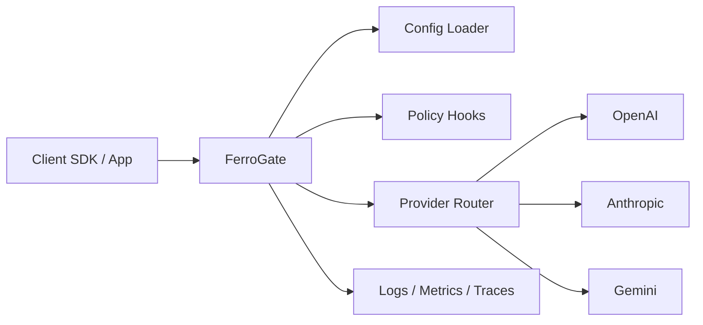

# System architecture

## Main components

- **CLI**: starts the gateway and validates configuration.
- **HTTP server**: exposes health and OpenAI-compatible endpoints.
- **Configuration loader**: reads `ferrogate.toml` and provider settings.
- **Provider router**: maps incoming requests to upstream model providers.
- **Policy layer**: future extension point for auth, quotas, and governance.
- **Observability layer**: logs, metrics, traces, and usage accounting.

## Design notes

FerroGate should remain simple at the core. Provider-specific behavior should be isolated behind clear interfaces so new providers can be added without coupling them to the HTTP layer.
